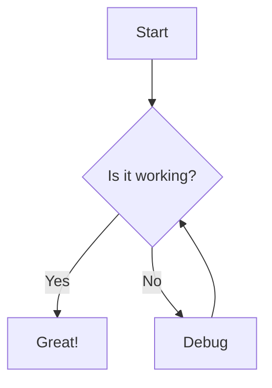

+++
title = 'My First Post'
date = '2025-08-04T12:03:36+05:30'
draft = false
categories = ["Blog"]
tags = ["Hugo", "Tutorial"]
+++

# Welcome to My Hugo Blog

This is my first post using the Hugo Narrow theme. The theme supports many features including:

## Features Configured

- **Recent Posts**: Shows the 5 most recent posts on the homepage
- **Related Posts**: Displays 3 related posts at the bottom of each post
- **Reading Progress**: Shows a progress bar while reading posts
- **License Information**: CC BY-NC-SA 4.0 license displayed on posts
- **Multiple Themes**: Support for various color schemes
- **Dark/Light Mode**: Toggle between dark and light themes

## Code Example

```javascript
function helloHugo() {
    console.log("Hello from Hugo Narrow theme!");
    return "Welcome to my blog";
}
```

## Math Support

The theme supports KaTeX for mathematical expressions:

$$E = mc^2$$

## Mermaid Diagrams



This post demonstrates various features of the Hugo Narrow theme. Check out the navigation menu and theme switcher in the header!
